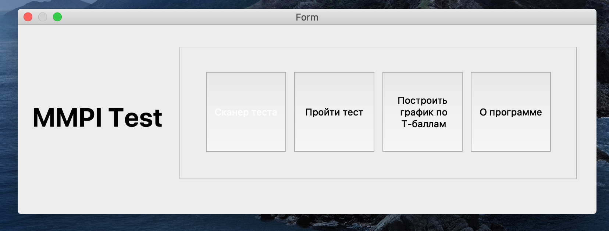
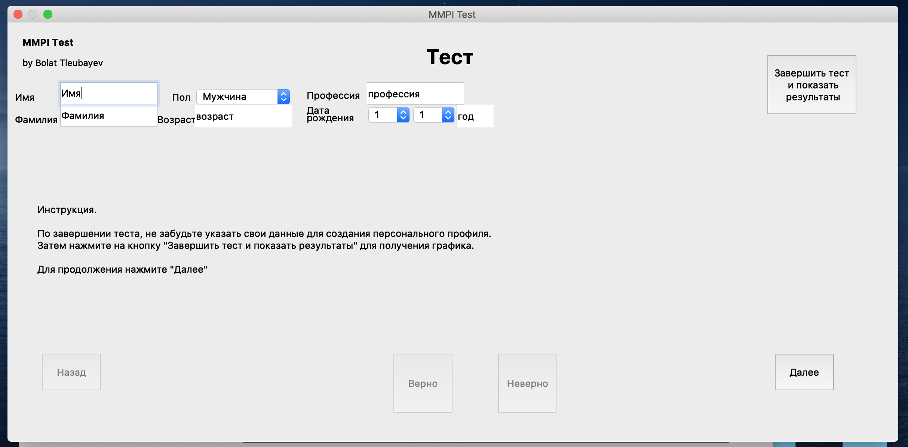
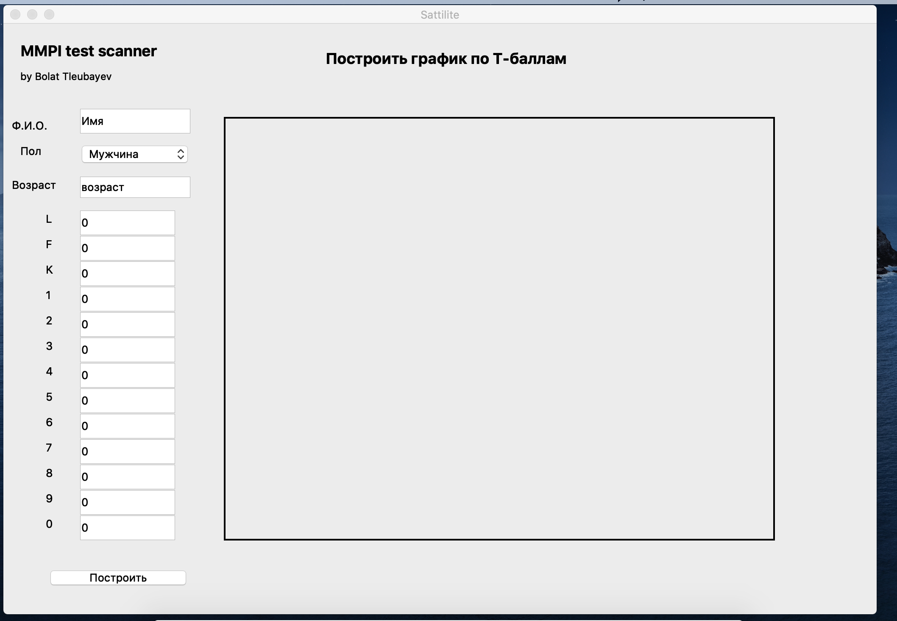
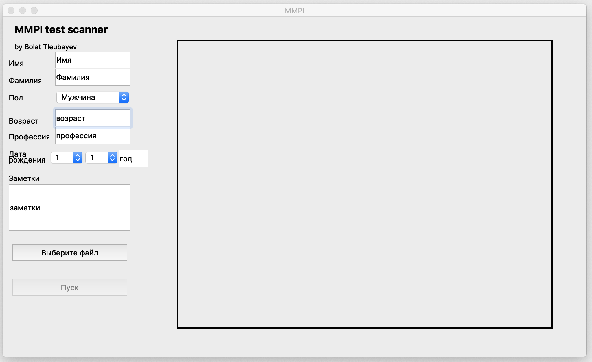
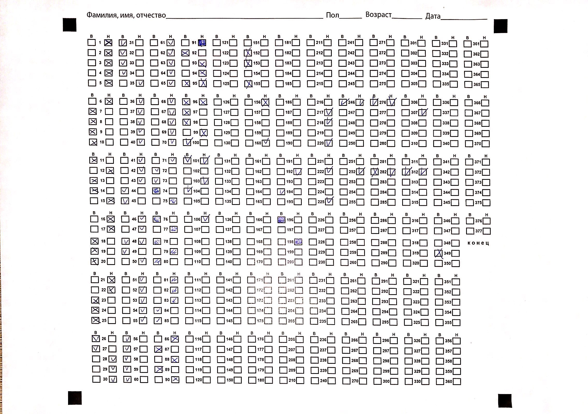
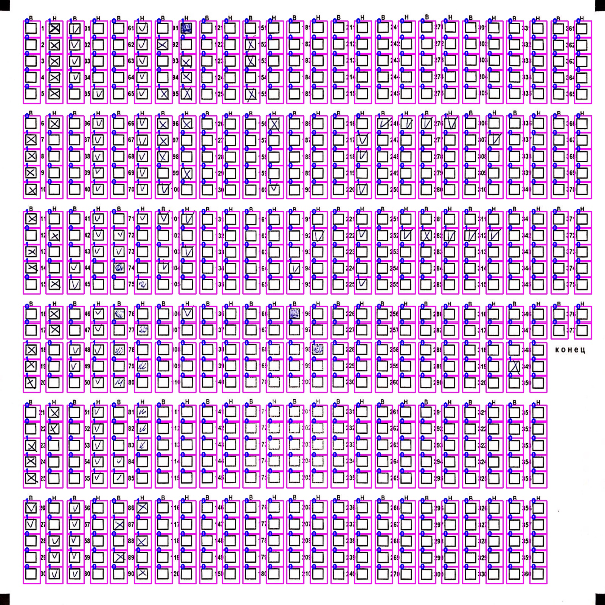

# MMPI Test Checker

### About

This program was done for non-commercial, personal use in order to check the possibility of automation of MMPI (or generally any other) test taking using Computer Vision and Machine Learning.

There are several modes of operation:

* Test checker - CV and ML based solution to check paper-based tests
* Online test - users can answer question in the program and obtain results in the end
* Profile plotter - plots previously interpreted tests

  
  
  
  

This project used following Python 3 libraries to different extents:

* Keras
* OpenCV
* PyQt5

### Workflow of Test Checker

#### Pre-processing
Firstly, the raw image that was placed placed in _../raw/_ folder, it is then being binarized. Then the several morphological operations are performed in order to obtain locations of four black squares in each respective corner. After that, the image is being transformed using _Affine Transformation_ so that all input images were of the same shape before feeding it to the counting algorithm.

#### Counting
After pre-processing step all answer boxes are being classified as _checked_ or _empty_. For those purposes Keras CNN was  used due to its simplicity in use and model handling. The data about checkboxes is then sent to counting algorithm, that was based on MMPI interpretation schemes, to compute and plot the user profile.

  
  
  

### Guidelines

_A short note on installation:_ Before the installation process of PyQt please install pyqt-sip. For some reason, more often than not this order reduces crashes occurrence during the launch

To start the application you need to have installed:

* Python 3
* Tensorflow based Keras
* OpenCV

To launch the application navigate to the project folder, type _python main.py_ and hit enter.

### Credits
The MMPI questions are taken from F. B. Berezin's adaptation of the MMPI test

